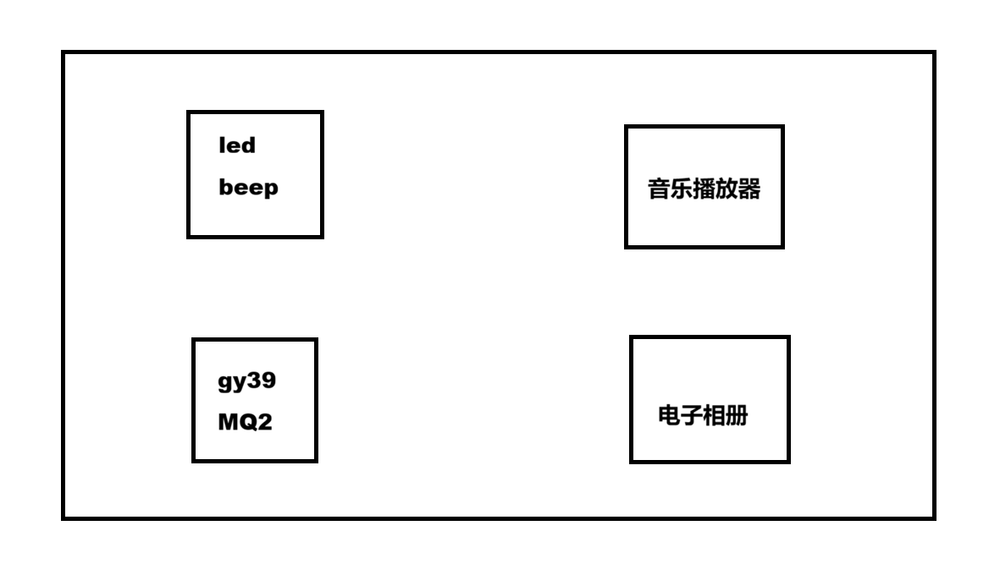
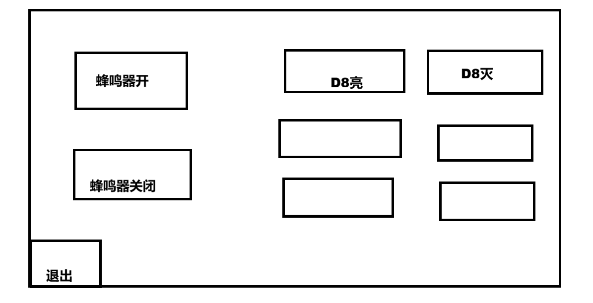
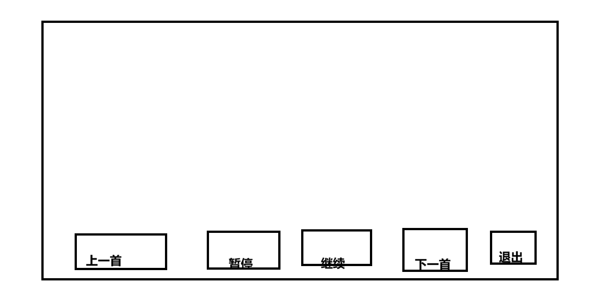
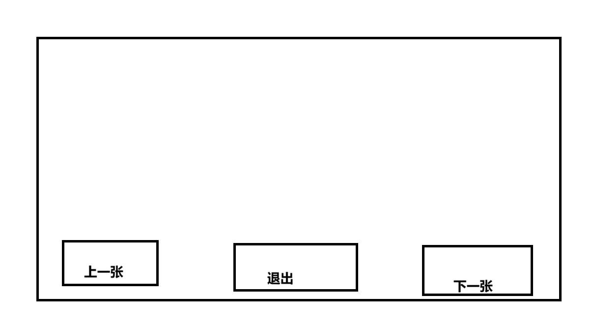

# 14-项目整合

**主界面：**

获取点击坐标，判断具体点击到了哪个功能模块



```C
int main()
{
	//初始化
	
	while(1)
	{
		//获取点击屏幕的坐标
		//根据坐标判断具体点击到了哪个功能按键
		if() //led及蜂鸣器
		{
			led_beep();//调用led及蜂鸣器控制按钮
		}
		else if() //madplay
		{
			madplay_ctl();
		}
		else if() //gy39及mq2
		{
		
		}
		else if() //电子相册
		{
			ctl_bmp();
		}
	}
}
```


**led及蜂鸣器：**



```C
void led_beep(void)
{
	while(1)
	{
		//获取点击屏幕的坐标
		if() //蜂鸣器响
		{
			ctl_pwm(PWM_ON);
		}
		else if() //蜂鸣器关闭
		{
			ctl_pwm(PWM_OFF);
		}
		//....
		else if() //退出
		{
			//记得把所有的LED及蜂鸣器关闭
			break;
		}
	}
}
```


**madplay音乐播放器**



```C
void madplay_ctl(void)
{
    char *mp3_path[3]={"1.mp3", "2.mp3", "3.mp3"};

    int i =0;
    while(1)
    {
        int x, y;
        char madplay_cmd[56] = {0};
        enum DIR dir = get_touch_dir(&x, &y); //获取点击屏幕的坐标

        if(dir == CLICK)
        {
            if() //上一首
            {
                system("killall -9 madplay");//关闭原来播放的音乐
                i--;
                if(i < 0)
                    i = 2;
                sprintf(madplay_cmd, "madplay %s &", mp3_path[i]); //保存新要播放的音乐指令
                system(madplay_cmd); 
            }
            else if() //暂停 / 继续
            {

            }
            else if() //下一首
            {
                system("killall -9 madplay");//关闭原来播放的音乐
                i++;
                if(i == 3)
                    i = 0;
                sprintf(madplay_cmd, "madplay %s &", mp3_path[i]); //保存新要播放的音乐指令
                system(madplay_cmd);
            }
            else if() //退出
            {
                system("killall -9 madplay");//关闭原来播放的音乐
                break;
            }
        }
    }
}
```


**GY39及MQ2：**

数据可以刷新显示在LCD显示屏上

附加功能：当光照强度较低时，自动开启LED，光强较大时，关闭LED

​                    烟雾浓度大于阈值时，蜂鸣器报警，反之蜂鸣器关闭


**电子相册:**



```C
void ctl_bmp(void)
{
	char *bmp_path[4] = {"1.bmp", "2.bmp", "3.bmp", "4.bmp"};
	int i = 0;
	
	lcd_display_bmp(bmp_path[i], 显示的x坐标，显示y坐标);
	
	while(1)
	{
		//获取滑动方向 / 点击坐标 （滑动控制 / 点击控制）
		if() //上一张
		{
			i--;
            if(i < 0)
            	i = 3;
            lcd_display_bmp(bmp_path[i], 显示的x坐标，显示y坐标);
		}
        else if() //下一张
        {
            i++;
            if(i == 4)
            	i = 0;
            lcd_display_bmp(bmp_path[i], 显示的x坐标，显示y坐标);
        }
        else if() //退出
        {
            break;
        }
	}
}
```


**项目验收要求：** 上课找我验收，看代码

-   基础功能必须完成 （附加功能）
-   界面设计
-   代码规范及整体思路
-   组内分数也有区别（分工及回答问题的情况）

**综合项目成绩： 项目验收分 + 答辩分数**

**总成绩 = 平时成绩 + 综合项目成绩 + 报告成绩**


**阿里巴巴矢量图标库： 下载图标**


